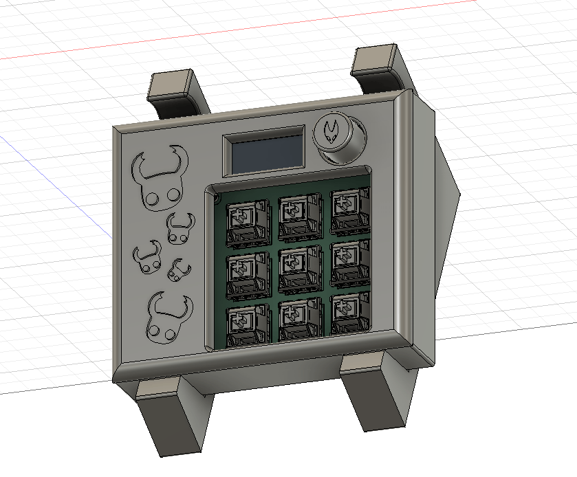
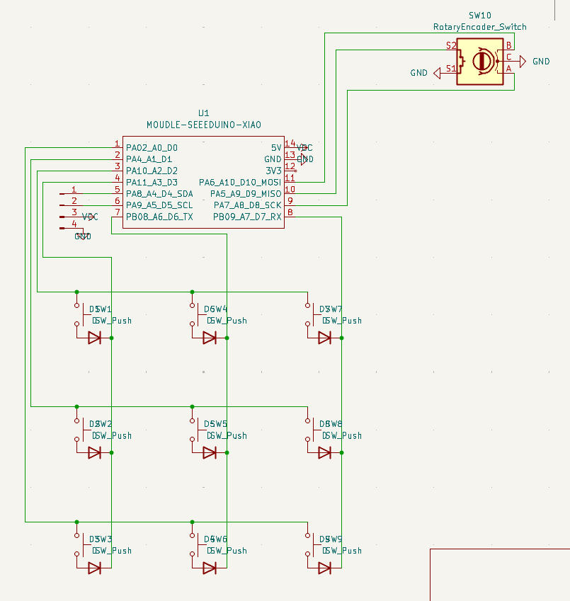
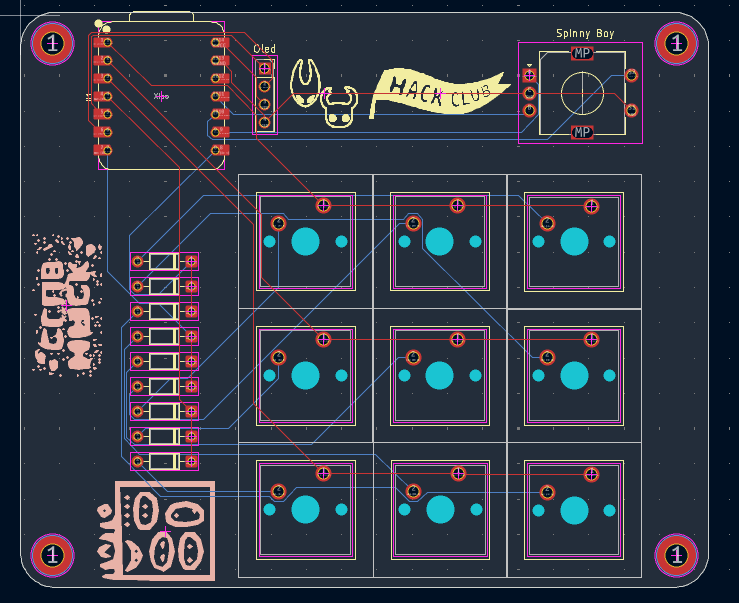

# HollowPad

    HollowPad was my attempt of upgrading my first ever project.. Nanokey. 
    HollowPad features a more flesh out design with 9 keys, a 0.91 inch oled and a rotary encoder.

# Features:

    - 128x32 OLED Display
    - 9 Keys
    - Rotary Encoder

# CAD Model:

    HollowPad is divided in 3 parts.
    - The Main Piece feature holes for M3 brass inserts to screw the PCB in place
    - The Top Piece featuring some designs from Hollow Knight and Silk Song.
    - 2 stand Pieces so that the HackPad can be angled.

    Everything was 100% human made in AutoDesk Fusion. Cuz lowk its free and intuitive!

# PCB
    It was made in KiCad. Only needing a few extra symbols and footprints provided by the Care Package of the HackPad mission from StarDance!

    The footprints for the Switches are standart MX style Switches!

**Schematic:**

**PCB Layout:**

# Firmware Overview
    This hackpad uses [QMK](https://qmk.fm/) firmware for everything. 

    - The 4 keys currently act as macros and are reprogrammable 
    - The OLED just shows some customs drawings i made in Piskel

# BOM:
    Here should be everything you need to make this hackpad

    - 9x Cherry MX Switches
    - 9x DSA Keycaps (or you can 3d print some)
    - 9x 1N4148 DO-35 Diodes.
    - 1x 0.91" 128x32 OLED Display
    - 1x XIAO RP2040
    - 1x Case (5 printed parts or 3 if u dont want the stand)

# Extra stuff
    Honestly this was just a peoject so i could see how far i had come in the little time ive been in stardance and i think it turned out pretty good!
    With all of that said i still suck at code so except some bugs especially on the rotary enconder since that was a pain to figure out.